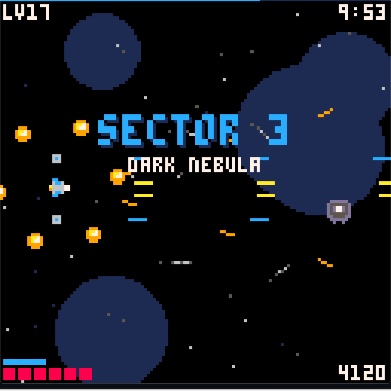

# pico-8-mcp

An [MCP](https://modelcontextprotocol.io) server that lets an AI assistant **build, test and balance PICO-8 games** —
not just count tokens. Edit a `.p8` cart, validate it, **simulate a whole 25-minute game headless in about a minute**,
author sprites / sound effects / music from readable notation, and launch the real PICO-8 to take screenshots.

Works with Claude Code, Claude Desktop, Codex, Cursor, or any other MCP client.

<p align="center">
  
  <br><em>STARVIVOR — a 25-minute shooter written, crash-tested and balanced with these tools (the boss fights were tuned from <code>simulate_cart</code> telemetry, not by playing it 30 times).</em>
</p>

> **Credits.** This is a fork of [EBonura/pico8-mcp-server](https://github.com/EBonura/pico8-mcp-server), which
> provided the original server and the cart analysis tools. Token counting, linting, minification and cart
> parsing come from [shrinko8](https://github.com/thisismypassport/shrinko8) by thisismypassport. PICO-8 is made
> by [Lexaloffle](https://www.lexaloffle.com/pico-8.php). This fork adds the headless simulator, window control,
> data-section authoring and the workflow skill.

## Why

Writing PICO-8 games with an LLM hits the same walls every time: you can't see the game, you can't play it for
20 minutes to check the balance, lint drowns you in false positives about globals, and the sprite / sfx / music
sections are raw hex nobody should type by hand. The tools here remove each of those:

| Problem | Tool |
|---|---|
| "Does it crash 12 minutes in?" / "Is sector 4 too hard?" | `simulate_cart` runs the game loop headless with telemetry |
| "Does this helper function work?" | `run_headless` runs any Lua against the cart and returns `printh` output |
| "Is my change easier or harder?" | `simulate_cart` with `runs`, `seed` and `summary_lua` gives min/avg/max over many games |
| "Let a bot play it" | `simulate_cart` `inputs_lua` presses buttons each frame, so `btn()`/`btnp()` work headless |
| "What does it look like?" | `run_cart` + `capture_game` return real screenshots |
| "Play it in real time" | `play_script` holds keys, waits and screenshots in one call and returns a filmstrip |
| "Draw me a sprite / write a jingle" | `set_sprite`, `set_sfx` (`"c4:2 e4:2 g4:4"`), `set_music`, `render_gfx` |
| 300 lint warnings about globals | `validate_cart` hides PICO-8-style global noise by default |

## Install

Requirements: [PICO-8](https://www.lexaloffle.com/pico-8.php) (any recent 0.2.x), Python 3.11+, [uv](https://github.com/astral-sh/uv).

```bash
git clone --recurse-submodules https://github.com/nutshot2000/pico-8-mcp.git
cd pico-8-mcp
uv sync
```

PICO-8 is auto-detected in the usual install locations on Windows, macOS and Linux, or set `PICO8_EXE` to the
executable path. The window tools (`run_cart`, `play_script`, `send_keys`, `capture_game`) are Windows-only for now; everything
else, including headless simulation, is cross-platform.

### Claude Code

```bash
claude mcp add pico8 --scope user -- uv --directory /path/to/pico-8-mcp run server.py
```

### Claude Desktop / other clients

```json
{
  "mcpServers": {
    "pico8": {
      "command": "uv",
      "args": ["--directory", "/path/to/pico-8-mcp", "run", "server.py"]
    }
  }
}
```

### Optional: the workflow skill

`skills/pico8-dev/SKILL.md` teaches Claude Code the edit → validate → simulate → look loop and the PICO-8
gotchas that bite LLM-written carts (fixed-point overflow, token budget, uninitialised globals). Copy it to
`~/.claude/skills/pico8-dev/SKILL.md` and it loads automatically whenever PICO-8 comes up.

## The workflow

1. Edit the `__lua__` section of the `.p8` as plain text.
2. `validate_cart` — tokens (8192 max), compressed size, syntax, meaningful lint.
3. `simulate_cart` — run it. Catch runtime errors (reported with cart line numbers) and read your own telemetry:
   levels per minute, kills, enemies on screen, boss HP, hits taken. Use `inputs_lua` to let a bot press the
   buttons, `patches` for god mode, `stop_when` to end on win/death, and `runs` + `summary_lua` to compare a
   balance change over many games instead of one lucky run. Saves are sandboxed, so bots never touch the
   player's best score.
4. `set_sprite` / `set_sfx` / `set_music`, then `render_gfx` to check the art.
5. `run_cart` + `play_script` / `capture_game` when you actually need to see it.

Example `simulate_cart` call:

```json
{
  "cart_path": "game.p8",
  "seconds": 1500,
  "setup_lua": "newgame() st=\"play\"",
  "log_every": 60,
  "log_lua": "\"lvl=\"..p.lvl..\" hits=\"..hits..\" enemies=\"..#e..\" boss=\"..(boss and boss.hp or 0)",
  "stop_when": "st==\"win\" or st==\"over\"",
  "patches": [
    {"old": "function hurt_p()\n if p.inv>0 then return end\n",
     "new": "function hurt_p()\n if p.inv>0 then return end\n hits+=1 p.inv=60 do return end\n"}
  ]
}
```

returns

```
[1:00] lvl=3 hits=2 enemies=4 boss=0
[2:00] lvl=5 hits=4 enemies=3 boss=0
...
[24:39] STOP lvl=31 hits=33 enemies=0 boss=0
```

Balance check over many games with a bot, no patches needed:

```json
{
  "cart_path": "tether.p8",
  "seconds": 180,
  "setup_lua": "newgame()",
  "inputs_lua": "if not hk then if ft%3==0 then press(5,1) end else press(5,2) end",
  "stop_when": "st==\"dead\"",
  "runs": 12, "seed": 1, "summary_lua": "h"
}
```

returns `SUMMARY over 12 runs: min=… avg=… max=…` plus each run's log, and a `peak frame cpu=` line
(pass `call_draw` to include draw cost - it matches PICO-8's own CPU meter closely).

## Tools

### Analysis (from shrinko8)
- **validate_cart** `(cart_path, lint="default"|"all"|"none")`
- **count_tokens**, **analyze_cart**, **search_code**, **compare_carts**, **list_carts**, **minify_cart**
- **read_cart** `(cart_path, section)` — code with PICO-8 glyphs intact, plus a summary of the sprites / sfx / music defined

### Headless execution (`pico8 -x`)
- **simulate_cart** `(cart_path, seconds, setup_lua, log_every, log_lua, stop_when, patches, call_draw, timeout,
  inputs_lua, runs, seed, summary_lua, real_cartdata=false)` — `inputs_lua` runs before every frame and calls
  `press(0..5)`; `runs`/`seed`/`summary_lua` batch and aggregate; `cartdata`/`dget`/`dset` live in memory
  unless `real_cartdata`
- **run_headless** `(cart_path, driver_lua, timeout)`

### Window control (Windows)
- **run_cart** `(cart_path, width=1024, height=1024, restart=true)` — `restart=true` closes any PICO-8 already
  running; pass `false` when a human may be playing in their own window. The window tools below then target
  the launched process by pid, never someone else's PICO-8 (or a browser tab with "pico-8" in its title)
  - and they wait for it: call them straight after `run_cart` and they wait for its window (and for PICO-8's
  boot text to clear) instead of failing. If that cart has closed they stop with an error rather than fall
  back to another window; pass `pid` to drive a different PICO-8 window on purpose
- **play_script** `(script, pid?, shot_size=256)` — real-time input in one call: `down:KEY up:KEY tap:KEY
  hold:KEY:MS wait:MS shot`; keys stay held until released, all are released at the end, and it waits for the
  cart to finish booting (keys sent during boot are lost). Returns a numbered filmstrip plus shot timings
- **send_keys** `(keys, pid?)` — `x z c v up down left right enter esc p space r f6`, `wait:MS`, `hold:KEY:MS`
- **capture_game** `(keys?, delay_ms, count, interval_ms, max_size, pid?)` — PNG screenshots of the game area
- **stop_cart**

### Data authoring
- **set_sprite** `(cart_path, index, rows, overwrite=false)` — rows of hex digits; 8×8 or larger blocks.
  The sheet is a 16-wide grid of 8×8 cells, so a 16×16 sprite at `index` also occupies `index+1`, `index+16`
  and `index+17` and is drawn with `spr(index, x, y, 2, 2)`. Place 16×16 sprites at 0, 2, 4 … and 32, 34 …
  — never at consecutive indices. The tool refuses to write a multi-cell block over cells that already contain
  pixels (the error explains the stride); `overwrite=true` forces it, e.g. when redrawing an existing sprite.
  The result includes the covered `cells` and the matching `spr()` call.
- **render_gfx** `(cart_path, sprites="0-15", scale, size=8)` — each index is one 8×8 cell by default, so a
  16×16 sprite appears as four labelled quarters; pass `size=16` and list the top-left indices to see it whole
- **set_sfx** `(cart_path, index, notes, speed, wave, volume, effect, loop_start, loop_end)` —
  `note:len:wave:vol:fx` tokens, `r` = rest, a4 = 440 Hz, range c2..d#7
- **set_music** `(cart_path, pattern, channels[4], loop_start, loop_end, stop)`

## PICO-8 facts the tools rely on

- Numbers are 16.16 fixed point: **anything above 32767 wraps negative**. A frame counter overflows at 18:12
  and `for i=1,36000` runs zero times. Track time in seconds; keep scores small.
- Code budget: 8192 tokens, 65535 chars, 15616 compressed bytes.
- `__gfx__` rows are 128 hex chars, `__sfx__` rows 168 chars (`00 speed loop_start loop_end` + 32 × `pitch wave vol fx`),
  `__music__` rows `flags ch0ch1ch2ch3` with `41..44` meaning a muted channel.
- `pico8 -x cart.p8` runs a cart headless; `printh` goes to stdout. On a runtime error it prints the message and
  hangs, and if `_update`/`_draw` exist it starts the game loop — the server handles both.
- The screen is always 128×128; `-width`/`-height` only scale the window.

## Development

```bash
uv run python test_p8tools.py            # runs against examples/demo.p8
uv run python test_p8tools.py my.p8      # or your own cart
uv run python test_tools.py              # the analysis-tool smoke tests take the same optional cart argument
```

`server.py` registers the MCP tools; `p8tools.py` holds the simulator, window control and data authoring;
`shrinko8/` is the analysis submodule. Contributions welcome — a macOS/Linux capture backend and a `set_map`
tool are the obvious next additions.

## License

MIT — see [LICENSE](LICENSE). shrinko8 is MIT licensed by its author; the original server is © EBonura.
